# Interlude 

Interlude is a context-aware ad placement engine for long-form video. It understands Bengali episodes across scenes, speech, and story context to find natural ad breaks, avoid interrupting dialogue, and match each break with a safe, relevant brand. It then generates VMAP 1.0 with embedded VAST 3.0 and a playable flow that pauses the episode for the ad and resumes seamlessly.

## What the app includes

| Capability | What it does |
| --- | --- |
| Full episode upload and background jobs | Streams an MP4 through the gateway, validates container, codec, audio, size and duration, and queues a persisted job. The workspace shows upload progress and processing stages. You can leave after upload, reopen an episode, cancel active analysis, or retry a failed job. |
| Scene and speech analysis | PySceneDetect finds raw visual cuts. Groq Whisper Large V3 supplies Bengali transcript timing, Silero VAD supplies an independent speech timeline, and the worker groups cuts into semantic scenes. Five-minute overlapping audio chunks allow complete episodes to be processed within hosted ASR request limits. |
| Safe opportunity ranking | Exact word and VAD speech crossings are hard blocked. Qwen analyzes local visual and narrative context; deterministic WHERE scoring combines visual strength, dialogue gap, semantic transition, narrative closure, shot stability and confidence. Every candidate, including rejected cuts, remains inspectable. |
| Contextual brand selection | Brands and negative contexts come from the JSON catalogue. Negative or unresolved sensitive context blocks a brand before relevance scoring. Eligible brands are ranked against the scene's activity and target contexts, then independently checked by Qwen for a SAFE verdict. A run may correctly return **no ad break**. |
| Episode-wide schedule | A bounded optimizer selects from ranked safe opportunities while enforcing minimum spacing, a rolling hourly break cap and maximum ad load using each creative's actual probed duration. It records why candidates lost to safety, quality or pacing. |
| Review workspace | Inspect episode metrics, a semantic scene timeline, the final schedule, candidate scores and reasons, brand eligibility, and a centered Qwen explanation with supporting observations for each selected placement. |
| Real playback | The player runs the source MP4, inserts an actual MP4 creative at an accepted break, and resumes content. Clicking a schedule timestamp first plays three seconds of the episode before the break, then plays the ad and resumes at that timestamp. Forward seeking skips crossed breaks; ordinary automatic breaks play once. |
| Exports | Download **VMAP XML**, debug JSON, semantic scenes JSON and candidates JSON from the review. The analysis manifest is also available through the API. All exports come from the same final decisions, so the player and VMAP do not use separate placement policies. |
| Protected local gateway | One shared team workspace uses a password-backed session when configured. The gateway serves the Next.js UI and same-origin API on localhost ports 3000 and 8080, streams large uploads directly to FastAPI, and keeps the web container behind it. |

The supplied brands and ads are synthetic demo material. Placement decisions are derived from the uploaded episode and configured catalogue, not from sample filenames or hard-coded timestamps.

## Pipeline: from upload to an ad break

```mermaid
flowchart LR
  A[Upload and validate MP4] --> B[Queue background job]
  B --> C[Detect raw visual shots]
  C --> D[Transcribe and detect speech]
  D --> E[Generate candidates and block speech crossings]
  E --> F[Analyze scenes and context with Qwen]
  F --> G[Score break quality]
  G --> H[Exclude, rank and verify brands]
  H --> I[Optimize the episode schedule]
  I --> J[Export and play accepted breaks]
```



1. **Upload and queue.** The browser uploads the complete episode to `POST /api/videos` and shows transferred-byte progress. FastAPI streams it to local storage and uses `ffprobe` to validate an MP4 container, H.264 video, audio, size and duration. The defaults are 4096 MiB and 7200 seconds. It stores the video and a `QUEUED` job in MySQL. The upload request then ends; a separate worker owns analysis, persists stage progress and checkpoints, and maintains a lease and heartbeat. The user can reopen the episode, cancel an active job, or retry a failed one. Validated audio and model caches can make a retry cheaper.
2. **Find visual shots and prepare creatives.** The worker probes and hashes the source, loads the JSON brand catalogue, and probes each creative's real duration. A missing creative becomes a visibly labeled, six-second synthetic demo MP4. PySceneDetect's `ContentDetector` finds raw picture cuts. A camera-angle cut is only a shot boundary; it is not automatically a new narrative scene or an ad opportunity.
3. **Build two speech timelines.** FFmpeg extracts mono 16 kHz audio in five-minute cores with two-second overlap at chunk edges. Groq-hosted **Whisper Large V3** transcribes Bengali (`bn`) with segment and word timestamps. Local CPU **Silero VAD** independently marks audible speech using a 0.4 threshold and 150 ms padding. Chunk timings are translated to episode time and merged conservatively across seams. Invalid or out-of-range timestamps fail analysis rather than being treated as silence.
4. **Create candidate times and block speech crossings.** Every raw shot boundary becomes a candidate. If a Whisper word or Silero speech region crosses the exact cut time, that candidate is hard rejected. Broad Whisper segment envelopes provide context and diagnostics, not the hard gate. The engine records surrounding speech and the clear gap; a short gap lowers quality but has no separate minimum-silence veto. Rejected candidates remain available for inspection.
5. **Understand the surrounding story.** At every raw boundary, including speech-blocked cuts, and at periodic context samples about 20 seconds apart, FFmpeg samples roughly one frame per second over a ±5-second window and scales frames to 640 pixels wide. The configured hosted **Qwen vision-language model** receives those frames, nearby transcript and catalogue-derived context labels. It returns schema-validated activity, narrative and dialogue continuity, transition type and confidence, sensitive context and timestamped evidence. Windows can be requested concurrently but are consumed in time order. Failed or malformed perceptions cannot approve an ad.
6. **Group semantic scenes and remember sensitive context.** Strong, affirmative Qwen transition evidence splits raw shots into semantic scenes; uncertain transitions and ordinary camera changes keep shots together. This grouping does not authorize placement. Periodic observations also maintain recent sensitive context for up to 90 seconds by default, including continuing narrative context. Failed or stale observations make brand eligibility uncertain.
7. **Score WHERE a break fits.** A speech-safe candidate with valid semantic analysis gets a deterministic weighted score: visual cut strength 25%, nearby dialogue gap 20%, semantic transition 20%, narrative closure 20%, neighboring shot stability 10% and model confidence 5%. A confirmed semantic boundary boosts the transition component. An unfinished ongoing sequence can receive a deduction, relieved by a long pause. The default combined quality floor is 0.55. No model score can reverse a speech hard block.
8. **Choose WHAT brand can run.** The engine first checks every brand's catalogue negative contexts against current and recent observations. A conflict, unmapped sensitive context or uncertain context memory blocks eligibility before relevance scoring. Eligible brands are ranked by dominant activity fit (60%), target-context overlap (25%), category fit (10%) and secondary context (5%), adjusted by perception confidence. Qwen then independently checks each ranked brand against frames, dialogue and recent context. Only `SAFE` at confidence at least 0.9 can proceed. If none passes, that candidate receives no ad.
9. **Decide WHETHER and optimize the whole episode.** The engine makes options from a passing candidate, safe brand and its creatives, using each creative's probed duration. A deterministic bounded beam search chooses the schedule by placement quality and brand fit. It enforces at least 30 seconds between breaks, at most 12 breaks in any rolling hour, and total ad duration no greater than 10% of episode duration by default. It records why other candidates lost. A truncated search frontier is disclosed; the selected schedule still satisfies the constraints. Zero accepted breaks is a valid result.
10. **Persist, review and play.** The worker writes the canonical analysis manifest, detailed debug JSON, semantic scenes, all-candidate JSON/CSV and VMAP 1.0 with embedded VAST 3.0 from the same final decisions. It also creates short inspection clips for accepted and selected rejected cuts. The workspace shows scene boundaries, scores, safety reasons and the final schedule. For a selected placement, an on-demand Qwen explanation summarizes recorded evidence without changing the decision. Playback pauses the episode, plays the actual creative MP4, then resumes content; a missed safe-start window or forward seek skips the automatic break.

**Models used:** Groq-hosted Whisper Large V3 handles Bengali speech-to-text; Silero VAD runs locally on CPU for speech detection; and hosted Qwen handles scene perception, independent brand-safety verification and on-demand explanations. Set `LLM_MODEL=Qwen/Qwen3-VL-30B-A3B-Instruct` to use that Qwen model with a compatible hosted endpoint. The active model is the value configured in `LLM_MODEL`. PySceneDetect, FFmpeg/ffprobe, weighted scoring, brand matching and schedule optimization are deterministic software components. Model observations are probabilistic, so the evidence review remains useful for editorial sign-off.

## Start with Docker Compose

You need Docker with Compose, an existing MySQL database, a Groq API key, and an OpenAI-compatible hosted Qwen endpoint. The repository does not start another database or a local Qwen server.

```bash
cp .env.example .env  # Only for a new setup; never overwrite your existing .env.
```

Fill in the database, Groq and Qwen values in `.env`. For a protected workspace, set `WORKSPACE_PASSWORD` and a random `SESSION_SECRET`; production requires a password of at least 16 characters, a secret of at least 32 characters, HTTPS and secure cookies. Keep `.env` out of Git.

```bash
docker compose up -d --build
# If your Docker installation has the standalone command, use: docker-compose up -d --build
```

Open **http://localhost:3000** or **http://localhost:8080**. Both ports go through the same gateway. The migration runs before the API and worker start. Compose retains media and reports in named volumes; routine shutdown is `docker compose down` without `-v`.

To update only the frontend after a UI change:

```bash
docker compose up -d --build --no-deps web
```

The API and worker use the external services configured in `.env`. Do not run a host worker and a container worker against the same database unless they share the same media paths.

## Use the workspace

1. Sign in if the workspace is protected. Choose an H.264 MP4 with audio and click **Analyze episode**. Keep the tab open until the upload finishes; analysis continues in the worker afterward.
2. Watch the job stages or return through **Recent episodes**. Jobs and progress are persisted. A failed or cancelled analysis exposes a retry path; unavailable source media is marked in the library.
3. Open a completed episode. The review shows duration, semantic scene count, candidate count, selected placements and ad load. Click the timeline to inspect a scene.
4. Review the final schedule and play the episode. A schedule click starts three seconds before its break so you can hear and see the lead-in, then plays the selected creative and resumes content.
5. Filter candidates to **All candidates**, **Selected** or **Safety blocked**. Inspect WHERE components, rejection reasons, brand eligibility and the grounded Qwen explanation for a selected brand.
6. Download the exports you need. A completed analysis can also be reopened with `?video=<video_id>`.

### Exports and artifacts

| Output | Where | Contents |
| --- | --- | --- |
| VMAP XML | **VMAP** button or `GET /api/videos/{video_id}/vmap` | VMAP 1.0 break offsets with embedded VAST 3.0 linear ads, creative media URLs and actual creative durations. Only accepted breaks appear. |
| Analysis JSON | `GET /api/videos/{video_id}/analysis` | Canonical episode manifest, summary and selected `ad_breaks` consumed by the player. |
| Debug JSON | **Debug JSON** button or `GET /api/videos/{video_id}/debug` | Scene, candidate, score, brand-safety, schedule and processing evidence. Partial debug data is available for unfinished or failed jobs. |
| Scenes JSON | **Scenes** button or `GET /api/videos/{video_id}/scenes` | Semantic scene boundaries, shot membership and grouping reasons. |
| Candidates JSON | **Candidates** button or `GET /api/videos/{video_id}/candidates` | Candidate timestamps, hard blocks, score components, ranks and final decisions. |
| Candidates CSV and inspection clips | Generated under `data/outputs/<job_id>/` and report directories | A spreadsheet-friendly candidate export and short review clips for selected or diagnostically useful cuts. These are local artifacts, separate from the workspace download buttons. |

VMAP is the ad schedule format used here. It is generated from the same accepted decisions as analysis JSON, but external ad-server certification has not been claimed.

## Configuration

The checked-in [.env.example](.env.example) lists every supported setting and its default. The main groups are:

| Variables | Purpose |
| --- | --- |
| `DB_HOST`, `DB_PORT`, `DB_USER`, `DB_PASSWORD`, `DB_NAME` | Existing MySQL connection. |
| `GROQ_API_KEY`, `ASR_*` | Groq Whisper Large V3 transcription, Bengali hint, timing, retries and timeouts. |
| `LLM_API_URL`, `LLM_MODEL`, `LLM_API_KEY`, `LLM_*` | Hosted OpenAI-compatible Qwen perception and safety checks. |
| `BRANDS_PATH`, `DATA_DIR`, `REPORTS_DIR`, `MEDIA_BASE_URL` | Catalogue, media, reports and exported creative URL base. |
| `MAX_UPLOAD_MB`, `MAX_VIDEO_DURATION_SEC` | Default 4096 MiB and 7200 seconds. If you raise the upload cap, also update the gateway's `client_max_body_size` in `deploy/nginx.conf`. |
| `MAX_BREAKS_PER_HOUR`, `MIN_BREAK_GAP_SEC`, `MAX_AD_LOAD_PERCENT` | Rolling pacing limits; defaults are 12 breaks per hour, 30 seconds apart and 10% ad load. |
| `MIN_WHERE_SCORE`, `WHERE_*`, `SAFETY_MIN_CONFIDENCE`, `SEMANTIC_*` | Quality weights, model confidence, independent safety floor and bounded semantic concurrency. |
| `WORKSPACE_PASSWORD`, `SESSION_SECRET`, `SESSION_COOKIE_SECURE`, `ENVIRONMENT` | Shared workspace session and deployment security. |
| `UPLOAD_RETENTION_HOURS`, `WORK_RETENTION_HOURS` | Retention controls for source and scratch data. |

The catalogue defaults to `content-sample-assets-folder/brands.json`. It accepts an array or `{ "brands": [...] }`; brand IDs are data, not policy branches. A missing local creative is replaced by a labeled synthetic MP4 demo creative, and its probed duration is used for pacing. Adding a validated brand does not require code changes; restart and reanalyze to use a changed catalogue.

## Run from source

Use Python 3.11–3.13, [uv](https://docs.astral.sh/uv/), Node.js 22 with npm, FFmpeg and ffprobe. Supply the same external MySQL, Groq and Qwen credentials in `.env`.

```bash
uv sync --python 3.11
cd apps/web && npm ci && cd ../..
uv run python scripts/migrate.py
```

Run these in separate terminals from the repository root:

```bash
uv run uvicorn interlude.main:app --host 127.0.0.1 --port 8000
uv run python -m interlude.worker
cd apps/web && npm run dev
```

Open `http://localhost:3000`. Stop the Compose gateway first if it already holds port 3000. The Next.js development server proxies `/api` to `http://127.0.0.1:8000`; the Compose gateway is the supported path for large streamed uploads. Build the frontend with `npm --prefix apps/web run build` for a production frontend image.

## API and operations

| Endpoint | Purpose |
| --- | --- |
| `POST /api/session`, `POST /api/session/logout` | Sign in or out of the shared workspace. |
| `POST /api/videos`, `GET /api/videos` | Upload an episode and list episodes with their latest jobs. |
| `POST /api/videos/{video_id}/analyze?force=true` | Queue a new analysis when a fresh run is required; active duplicate requests reuse the current job. |
| `GET /api/jobs/{job_id}`, `POST /api/jobs/{job_id}/cancel` | Read progress or cancel an active job. |
| `GET /api/videos/{video_id}/media`, `GET /api/ads/{brand_id}/{creative_id}` | Serve source and creative MP4s for playback. |
| `POST /api/videos/{video_id}/candidates/{candidate_id}/explanation` | Explain an accepted brand selection with Qwen and return recorded evidence. |
| `GET /api/brands` | Return the validated catalogue. |
| `GET /health`, `GET /ready` | Process liveness and dependency/configuration readiness. |

The export endpoints are listed above. `/ready` checks configuration, schema, storage and local media tools; it does not prove that external inference requests will succeed. Jobs use leases and heartbeats, and a cancelled or stale worker cannot publish a completed manifest. Validated inference caches allow retries to reuse completed work. The retention command previews deletions by default; `--apply` is required to remove eligible expired media:

```bash
uv run python -m interlude.cleanup
uv run python -m interlude.cleanup --apply
```

## Verification

```bash
uv run pytest -q
uv run ruff check apps/api tests scripts
npm --prefix apps/web test
npm --prefix apps/web run typecheck
npm --prefix apps/web run build
```

For a real completed episode with an accepted break, browser verification exercises the actual MP4 lead-in, ad playback and resume path:

```bash
uv run python scripts/browser_verify.py --manifest /absolute/path/to/analysis.json
```

See [Phase 3 deployment and operations](docs/PHASE3.md), [Phase 3 verification](docs/PHASE3-VERIFICATION.md), [placement calibration](docs/PLACEMENT-CALIBRATION.md), [Phase 2 policy](docs/PHASE2.md) and the [architecture record](docs/ARCHITECTURE.md) for deeper evidence and design decisions.

## Scope and limits

Interlude is one shared workspace, not a multi-tenant ad platform. It uses hosted ASR and Qwen, an existing MySQL database, a CPU worker and local/volume-backed media storage. Model interpretation is probabilistic, and the safety checks are conservative safeguards rather than a guarantee for every unseen episode. Full episode jobs need enough disk, CPU time and external provider quota. Public deployment needs an HTTPS reverse proxy and the production session settings described in [docs/PHASE3.md](docs/PHASE3.md).
