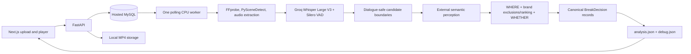

# Phase 1 architecture

`domain.py` owns canonical validated contracts. Scene detection returns visual segments, not a claim that every cut is a meaningful narrative transition. Qwen inspects only surviving local windows to estimate that transition. No candidate timestamp is manually authored.

`providers/` owns network protocols, normalization and bounded retry. The LLM URL must be a configured OpenAI-compatible `/v1` or `/chat/completions` URL. No local Qwen weights, alternate model or invented server endpoint. Exact configured model name is preserved. Groq receives mono 16 kHz audio with `whisper-large-v3`, Bengali hint, verbose JSON and segment/word timing. Malformed timestamps fail analysis; empty transcript is allowed only with an explicitly empty segment response.

`services/` owns media, speech timelines, candidate prefiltering, synthetic creatives, matching, WHERE, pacing and serialization. Silero JIT weights arrive with its wheel and execute on CPU. Frames are sampled at one FPS over ±5 seconds, resized to 640px and paired with timestamps. Audio and frames live in a TemporaryDirectory and are deleted after processing. Retained debug contains exact sample timestamps, not deleted image data. Uploaded source and generated creatives remain available for playback.

## Decision rules

ASR segments and VAD intervals are unioned for safety. Either signal active at a cut rejects it. Both sides need at least 0.5 seconds speech separation. Adjacent scenes must each last 2 seconds; cuts within 10 seconds of content edges or below measured visual strength are rejected. Silero pads speech intervals by 150ms at a conservative threshold of 0.4.

WHERE components are 0..1: visual difference capped at twice the PySceneDetect threshold; hard dialogue safety; minimum silence on either side saturated at 2 seconds; Qwen transition. Configured weights are normalized to sum to 1. Minimum semantic confidence is 0.7 and WHERE threshold is 0.65. High semantics can never reverse a speech rejection.

All brands are loaded dynamically. Context vocabulary is the union of target/negative labels and category components. Qwen maps synonyms and Bengali concepts to exact labels. Deterministic phrase matching considers activity, context, mood, sensitivity and narrative descriptions, with generic plural normalization and explicit sensitive-concept aliases such as mourning → grief and unconscious → medical emergency. A negative match is a hard exclusion; unmapped sensitive concepts reject all brands as uncertain. Only eligible brands with positive relevance are ranked: 60% dominant activity, 30% contextual overlap (saturates at 3 targets), 10% category. This is explainable lexical policy, not a guarantee that a perception model detects every implied unsafe event.

Candidates are considered in descending WHERE score with timestamp tie-break. No irrelevant brand is forced. Pacing uses the actual probed creative length and enforces minimum spacing, a rolling 3600-second count cap, and total ad seconds divided by source seconds. Short clips use the same rolling cap; the ad-load cap prevents oversized loads. Selected slots are serialized chronologically. This greedy Phase 1 selection is deterministic, not a globally optimal schedule.

## Persistence and recovery

Alembic creates nine application tables plus its version table. Media paths and JSON metadata live in MySQL; binaries do not. Checkpoints persist scenes, transcripts, all candidates and partial decisions. An API transaction inserts the uploaded video and QUEUED job. The worker claims with `SELECT FOR UPDATE SKIP LOCKED`; stages are validated and updated transactionally. Re-analysis reuses an active job rather than racing it. A job left in progress beyond its lease becomes FAILED on the next worker poll. External calls have bounded timeouts; the worker is intentionally a single process for Phase 1.

Artifacts are written atomically and registered before COMPLETED. Failed jobs expose structured error code/stage and persisted partial data at the debug endpoint. Provider bodies, headers, credential values, SQL parameters and raw exception messages are excluded from logs/API errors.

## Playback

Content and ad use distinct video elements. At a crossed accepted boundary, the player records the actual media time, pauses content, marks the break played and starts its creative. The manifest limits the latest start to the smaller of 250ms or half the verified following silence; overdue callbacks skip the break. A real ad `ended` event restores exactly that position and resumes content. Seeking forward marks crossed breaks skipped; backward seeks do not replay played ads. An autoplay restriction exposes a play button; failed ad media offers explicit content resume.

This is a local trusted hackathon service. Public deployment would require authentication, per-user access control, upload ingress quotas, worker leases with independent heartbeats, HTTPS and retention scheduling. Phase 1 binds local ports, limits uploads/duration and uses UUID media paths. Docker config is optional; no Docker engine was installed on the development machine.

## Upstream references

- [Groq speech-to-text API](https://console.groq.com/docs/speech-to-text)
- [PySceneDetect content detector](https://www.scenedetect.com/docs/api/detectors.html)
- [Silero VAD](https://github.com/snakers4/silero-vad)
- [Next.js installation](https://nextjs.org/docs/app/getting-started/installation)
